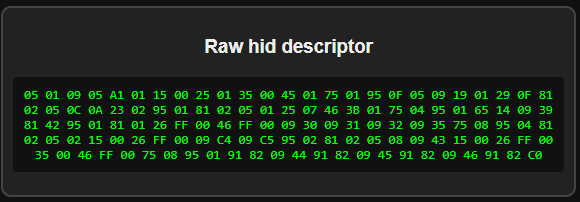
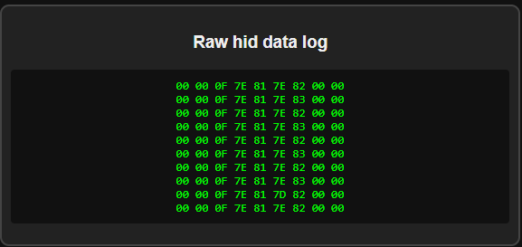
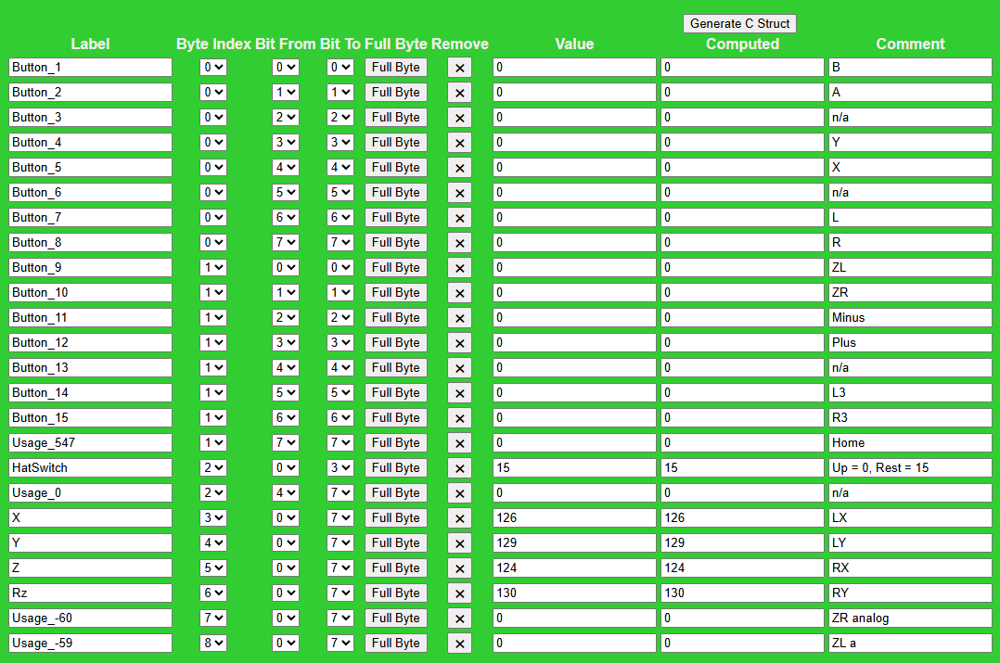
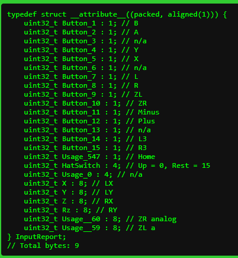

# pico_input_usb_tester

For testing usb devices on pico and mapping the hid data to struct fields.

The report struct will help me to add support for more devices on my adapters.
Might help other adapters authors too!

The HTML page is ugly but it works. It requires a browser with web hid support. Any Chrome based one should work.

The graphical input tester uses xinput naming and layout (south button is A).

### If you want to help

Wire a usb-a female port to a pico.
- D+ GPIO 0
- D- GPIO 1

- Flash the firmware.
- Connect the pico to a PC.
- Open the HTML file and connect to pico.
- After that, you can connect a game controller to the pico.
- Press some buttons, it should appear on-screen.
- Check the second tab (the ugly green one) for data map.
- Take notes using the comment field. For button names, note the original name (ie: b,a,triangle) or position (ie: top, left). Also the xinput name for that button (a,b,x,y)
- Then click generate C Struct.

Grab this info and post on Discussions:

- Raw HID Descriptor
- Raw HID Data log
- Struct
- USB ID with driver info.

Title should follow the format [VID] [PID] [NAME] [OTHER]. 
Ie: `0x0079 0x181C Gulikit Elves 2 Pro Android Mode`

#### About the `Device type` field
- `DRIVER_HID_PARSER` means that there's no mapping for that device.
It's most important to try to get a correct mapping.
- `DRIVER_HID_GENERIC` means that there's already a mapping for that device. You can test to see if it's correct.

There are other drivers that are used for known devices. They should map correctly too.

#### Rough list of supported devices

Most xbox (xbox/360/one/series) controllers should work. 
Same for devices that uses the VID:PID of other known device. Most 3rd party Switch controllers does that.

| Device                                                                              | Notes                                    |
|-------------------------------------------------------------------------------------|------------------------------------------|
| 8BitDo Arcade Stick (Xinput via usb cable or 2.4g dongle, Switch Pro via usb cable) |                                          |
| 8BitDo M30 BT (usb cable dinput)                                                    |                                          |
| 8BitDo NeoGeo (usb cable dinput)                                                    | (dongle requires adafruit tinyusb 3.4.3) |
| 8BitDo Pro 2 (usb cable dinput)                                                     |                                          |
| 8BitDo MicroPad (usb cable dinput)                                                  |                                          |
| 8BitDo N30 (usb cable dinput)                                                       |                                          |
| 8BitDo Mod Kit for Original MD Controller                                           |                                          |
| 8BitDo Mod Kit for Original N64 Controller (dinput)                                 |                                          |
| 8BitDo Ultimate 2.4g (usb cable dinput)                                             |                                          |
| ASCII SeaMic                                                                        |                                          |
| ASCII TranceVib (rumble only)                                                       |                                          |
| Dell USB Optical Mouse                                                              |                                          |
| Google Stadia                                                                       |                                          |
| Hori Pokken                                                                         |                                          |
| Hori Fighting Commander 4 "FC4" (PS3, PS4 mode)                                     |                                          |
| Hori Fighting Commander (PS3, PS4, PC mode)                                         |                                          |
| Hori Pad Mini 3                                                                     |                                          |
| Hori Mini 4 [PS4-099U]                                                              |                                          |
| Hori Pad Switch (also retrobit saturn and legacy16)                                 |                                          |
| Hori FlightStick / FS2                                                              |                                          |
| IBuffalo Snes                                                                       |                                          |
| Logitech Force 3d                                                                   |                                          |
| Logitech Force 3d Pro                                                               |                                          |
| Logitech Extreme 3d Pro                                                             |                                          |
| Logitech Driving Force (including Pro, DFGT, G25, G27 when in compatibility mode)   |                                          |
| Logitech G203                                                                       |                                          |
| MayFlash F101 Arcade Stick                                                          |                                          |
| MayFlash SS adapter                                                                 |                                          |
| Mad Catz PS3 RF pad                                                                 |                                          |
| Mad Catz R.A.T.7                                                                    |                                          |
| Manta MM812 (USB Saturn style gamepad)                                              |                                          |
| Micomsoft XE1AJ-USB (NEEDS TESTING)                                                 |                                          |
| Microsoft Xbox                                                                      |                                          |
| Microsoft Xbox360                                                                   |                                          |
| Microsoft XboxOne                                                                   |                                          |
| Microsoft XboxSeries                                                                |                                          |
| Microsoft Sidewinder ForceFeedBack 2                                                |                                          |
| Microsoft SideWinder Strategic Commander                                            |                                          |
| NeoGeo Arcade Stick Pro (dinput)                                                    |                                          |
| Nintendo Switch Pro                                                                 |                                          |
| Nintendo GC to WiiU adapter                                                         |                                          |
| PantherLord USB/PS2 2in1 Adapter, Twin USB Joystick                                 |                                          |
| PixArt USB Optical Mouse                                                            |                                          |
| PowerA Link pecial Edition (switch controller)                                      |                                          |
| PowerA Super Mario (switch controller)                                              |                                          |
| PXN F-16 Flight controller                                                          |                                          |
| Raphnet Dreamcast Adapter V1 (gamepad)                                              | UNTESTED                                 |
| Raphnet Dreamcast Adapter V2 (gamepad)                                              | UNTESTED                                 |
| Razer Atrox Xbox One Arcade Stick                                                   |                                          |
| Razer DeathAdder                                                                    |                                          |
| Razer Raion Fightpad (PS4, PC mode)                                                 |                                          |
| Reflex (new firmware - MPG)                                                         |                                          |
| Saitek X52                                                                          |                                          |
| Sega Astrocity Arcade Stick                                                         |                                          |
| Sega MD Mini                                                                        |                                          |
| Sony PS Classic                                                                     |                                          |
| Sony PS3                                                                            |                                          |
| Sony PS4 (Both DS4 models. Also the wireless adapter)                               |                                          |
| Sony PS5                                                                            |                                          |
| Steam Controller (usb cable or dongle)                                              |                                          |
| Taito Densha De Go PS2 Type 2 (two handle)                                          |                                          |
| ThrustMaster T.HotasX PS3 (Both in PC and PS3 modes)                                |                                          |
| ThrustMaster T.Hotas 4                                                              |                                          |
| ThrustMaster FGT Rumble 3-in-1 (PC mode) (must use individual pedals mode)          | (not compatible with PIO-USB)            |
| ThrustMaster F430 Cockpit Wireless (PC mode) (must use individual pedals mode)      | (not compatible with PIO-USB)            |
| Xenta / Compx 2.4G Receiver (mouse)                                                 |                                          |
| Zeebo Controller                                                                    |                                          |

#### Some screens of the info it shows

